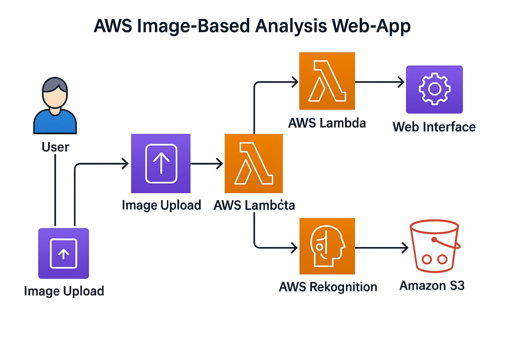

# AWS Image-Based Analysis Web-App

This project is a web-based application that allows users to upload images for analysis using AWS services like **AWS Lambda** and **AWS Rekognition**.

---
# Table of Contents
1. Overview
2. Features
3. Architecture Diagram
4. Project Structure
5. Installation
6. Git Commands Used
7. Usage
8. Contact
---

# Overview

A lightweight PHP-based frontend allows users to upload images, which are processed on AWS using Lambda and analyzed with Rekognition. Results are returned in near real-time.

---

##  Features

- Image Upload and Analysis  
- AWS Lambda for Backend Processing  
- PHP Frontend for User Interaction  
- AWS Rekognition for Image Analysis  

---
## 📊 AWS Architecture Diagram



##  Project Structure

```
Aws-Image-Analysis-App  
├── aws  
│   ├── lambda_function.py          # AWS Lambda function for image analysis  
│   ├── setup_instructions.txt      # Setup guide for AWS services  
├── php-app  
│   ├── index.php                   # Homepage for image upload  
│   ├── upload.php                  # Handles image uploads  
│   ├── composer.json               # PHP dependencies (AWS SDK)  
├── docs                            # Documentation and reports
│   ├── architecture.txt            # Discription
│   ├── aws-architecture.jpg        # Diagram   
├── .gitignore                      # Ignore unnecessary files  
├── README.md                       # Project description  
└── LICENSE                         # License information  
```

---

##  Installation

1. **Clone the repository:**
   ```bash
   git clone https://github.com/YourUsername/Aws-Image-Analysis-App.git
   cd Aws-Image-Analysis-App
   ```

2. **Install PHP dependencies:**
   ```bash
   cd php-app
   composer install
   ```

3. **Deploy AWS Lambda function using AWS CLI:**
   ```bash
   aws lambda create-function --function-name ImageAnalysisFunction \
     --zip-file fileb://lambda_function.zip \
     --handler lambda_function.lambda_handler \
     --runtime python3.x \
     --role arn:aws:iam::YOUR_ACCOUNT_ID:role/YOUR_LAMBDA_ROLE
   ```

---

# Git Commands Used

git init
git remote add origin https://github.com/Bsrikanth008/Aws-Based-Image-Analysis-Web-App.git
git checkout -b feature
git add .
git commit -m "Initial commit"
git push origin feature
git merge feature
git pull origin main
git push origin main

---

# Usage

Upload an image through the PHP frontend.

Image is sent to AWS S3.

Lambda function is triggered and calls Rekognition.

Analysis result is sent back to the frontend.


---

## Author
Created by [Srikanth Berla](https://www.linkedin.com/in/srikanth-berla-9bb743266)

---

## License

This project is intended for educational purposes.
